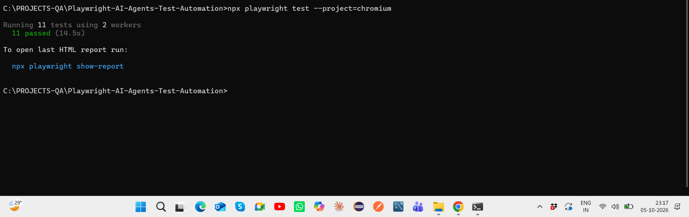
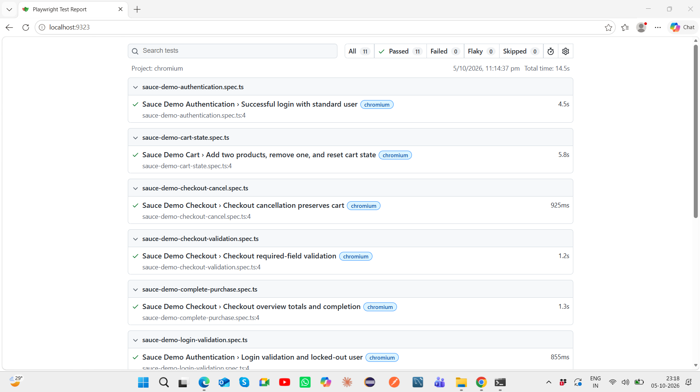
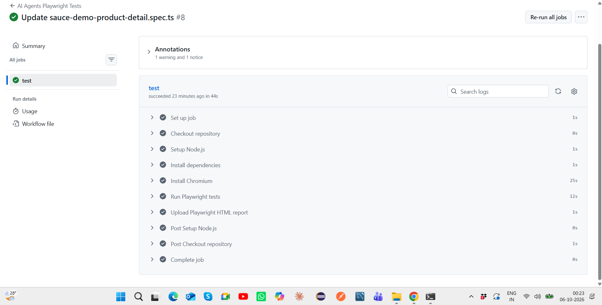

# Playwright AI Agents Test Automation

[](https://github.com/Pragya-19/Playwright-AI-Agents-Test-Automation/actions/workflows/playwright.yml)

AI-assisted end-to-end test automation project built using **Playwright, TypeScript, Playwright MCP, specialized QA agents, structured test planning, automated browser testing, HTML reporting, and GitHub Actions CI/CD**.

The project explores how AI agents can augment different stages of the software testing lifecycle while keeping **deterministic Playwright assertions and human review** at the core.

---

## Project Objective

The objective of this project is to demonstrate an AI-assisted QA workflow where specialized agents support:

- application exploration
- test planning
- test scenario generation
- Playwright test creation
- browser-based validation
- failure analysis
- test remediation
- re-execution
- CI/CD validation

The application under test is **SauceDemo / Swag Labs**.

---

## Tech Stack

- Playwright
- TypeScript
- Node.js
- Playwright MCP
- AI Testing Agents
- Git
- GitHub
- GitHub Actions
- Playwright HTML Reporter

---

## AI Agent Architecture

The repository contains three specialized QA agents.

### 1. Playwright Test Planner Agent

The Planner Agent is designed to:

- explore the application using browser tooling
- understand major user journeys
- identify functional and negative scenarios
- organize test coverage by feature
- create a structured test plan

A structured SauceDemo test plan is maintained under:

```text
specs/sauce-demo-test-plan.md
```

---

### 2. Playwright Test Generator Agent

The Generator Agent is designed to:

- consume planned test scenarios
- inspect the application through browser tooling
- translate scenarios into Playwright tests
- generate executable TypeScript test cases
- use Playwright locators and assertions
- maintain test code aligned with the planned coverage

The executable Playwright test suite is stored under:

```text
tests/
```

---

### 3. Playwright Test Healer Agent

The Healer Agent is designed to support:

- execution of failing Playwright tests
- failure-context inspection
- locator and DOM investigation
- debugging broken automation
- AI-assisted code remediation
- test re-execution after changes

The healing workflow is treated as **AI-assisted test remediation**, with human review retained before accepting changes.

This project does **not** claim a fully autonomous self-healing production framework.

---

## AI-Assisted QA Workflow

```text
Web Application
       ↓
Planner Agent + Playwright MCP
       ↓
Structured Test Plan
       ↓
Generator Agent + Browser Exploration
       ↓
Playwright TypeScript Tests
       ↓
Playwright Test Runner
       ↓
Assertions + Execution Results
       ↓
Failure / Debug Context
       ↓
Healer Agent
       ↓
AI-Assisted Diagnosis & Remediation
       ↓
Re-execution
       ↓
Human Review
       ↓
CI/CD Validation
```

---

## Project Structure

```text
Playwright-AI-Agents-Test-Automation
│
├── .github/
│   ├── agents/
│   │   ├── playwright-test-planner.agent.md
│   │   ├── playwright-test-generator.agent.md
│   │   └── playwright-test-healer.agent.md
│   │
│   └── workflows/
│       ├── playwright.yml
│       └── copilot-setup-steps.yml
│
├── .playwright-mcp/
│
├── .vscode/
│
├── docs/
│   └── screenshots/
│       ├── ai-agents-playwright-11-tests-passed.png
│       ├── ai-agents-playwright-html-report.png
│       └── github-actions-ai-agents-ci-passed.png
│
├── specs/
│   ├── README.md
│   └── sauce-demo-test-plan.md
│
├── tests/
│   ├── sauce-demo-authentication.spec.ts
│   ├── sauce-demo-login-validation.spec.ts
│   ├── sauce-demo-product-detail.spec.ts
│   ├── sauce-demo-sorting.spec.ts
│   ├── sauce-demo-cart-state.spec.ts
│   ├── sauce-demo-checkout-validation.spec.ts
│   ├── sauce-demo-checkout-cancel.spec.ts
│   ├── sauce-demo-complete-purchase.spec.ts
│   ├── sauce-demo-logout.spec.ts
│   ├── sauce-demo-navigation-drawer.spec.ts
│   └── sauce-demo-order-pdf.spec.ts
│
├── playwright.config.ts
├── package.json
├── package-lock.json
└── README.md
```

---

## Test Coverage

The current Playwright suite contains **11 automated test files** covering major SauceDemo workflows.

### Authentication

- successful login
- invalid credential validation
- login-field validation
- authentication-related negative scenarios

### Inventory & Product Validation

- inventory page behavior
- product detail validation
- product sorting
- product information validation

### Shopping Cart

- adding products to cart
- removing products
- cart-state validation
- cart persistence behavior

### Checkout

- checkout form validation
- required-field validation
- checkout cancellation
- complete purchase workflow
- order confirmation

### Navigation

- logout workflow
- navigation drawer behavior
- application navigation

### Additional Coverage

- order / PDF-related workflow validation
- application-state validation
- end-to-end business-flow testing

---

## Structured Test Planning

The repository includes an AI-assisted SauceDemo test plan covering:

- authentication
- inventory
- product details
- sorting
- cart operations
- checkout
- navigation
- session behavior
- resilience scenarios
- order-related workflows

The purpose of maintaining the test plan separately from the automation code is to preserve:

- test traceability
- coverage visibility
- separation between test design and test implementation
- easier human review of AI-assisted outputs

---

## Running the Project

### Install dependencies

```bash
npm install
```

### Install Chromium

```bash
npx playwright install chromium
```

### Run the stable Chromium suite

```bash
npm test
```

### Run all configured Playwright projects

```bash
npm run test:all
```

### Run in headed mode

```bash
npm run test:headed
```

### Open Playwright UI mode

```bash
npm run test:ui
```

### Open the Playwright HTML report

```bash
npm run report
```

---

## Current Execution Status

- **11 Playwright automated tests**
- **11/11 passing locally on Chromium**
- **GitHub Actions CI passing**
- Playwright HTML reporting enabled
- CI report artifact generation enabled
- AI Planner, Generator, and Healer agent definitions maintained in the repository

---

## Execution Evidence

### Local Playwright Execution

The current Chromium automation suite executes successfully with:

- **11 tests passed**
- **0 failed**



---

### Playwright HTML Report

The Playwright HTML report provides detailed execution results for the automated suite.



---

### GitHub Actions CI

The test suite also executes successfully in a clean Ubuntu CI environment using GitHub Actions.



The CI pipeline:

1. checks out the repository
2. sets up Node.js
3. installs dependencies
4. installs Chromium
5. executes the Playwright test suite
6. uploads the Playwright HTML report as an artifact

---

## CI Stability

The framework uses Playwright web-first assertions and explicit synchronization with meaningful application states instead of fixed delays.

For example, product-detail navigation waits for the expected application URL before validating the detail page.

This improves consistency between:

```text
Local Windows execution
        ↓
Headless Linux execution
        ↓
GitHub Actions CI
```

---

## What the AI Layer Does

The AI layer in this project is intended to **augment QA engineering**, not replace deterministic automation.

AI agents can support:

```text
Requirement / Application Understanding
                ↓
Test Planning
                ↓
Scenario Generation
                ↓
Automation Generation
                ↓
Failure Investigation
                ↓
AI-Assisted Remediation
```

Playwright remains responsible for deterministic browser execution and assertions.

Human review remains responsible for validating:

- generated scenarios
- locator quality
- assertion correctness
- business relevance
- agent-proposed code changes

---

## Key Concepts Demonstrated

- AI-assisted software testing
- Agent-based QA workflows
- Playwright MCP
- Structured test planning
- AI-assisted test generation
- AI-assisted failure analysis
- AI-assisted test remediation
- Playwright browser automation
- TypeScript
- End-to-end testing
- Positive and negative testing
- Web-first assertions
- CI stability
- HTML reporting
- GitHub Actions CI/CD
- Human-in-the-loop QA

---

## Key Learning

This project demonstrates an important principle for AI-assisted testing:

> AI can accelerate test design, generation, and debugging, but reliable QA still requires deterministic assertions, traceability, reproducible execution, and human validation.

The goal is not to remove the QA engineer from the loop, but to use AI to increase testing speed, coverage exploration, and debugging efficiency while maintaining engineering control.
